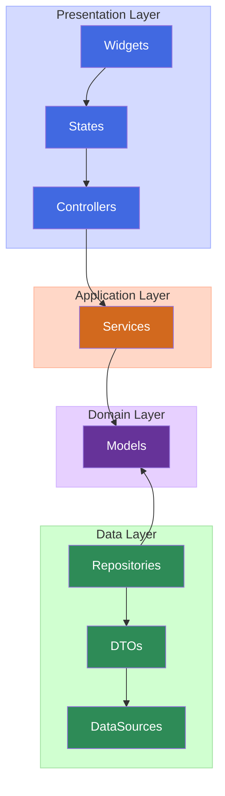

# コーディングスタイル(Flutter)

## TDD（テスト駆動開発）

このプロジェクトでは**TDD（Test-Driven Development）**を採用しています。

### TDDサイクル

**Red → Green → Refactor**

1. **Red（失敗するテストを書く）**
   - 期待する動作を定義するテストを最初に書く
   - `make test`でテストが失敗することを確認

2. **Green（テストを通す最小限の実装）**
   - テストが通る最小限のコードを実装
   - 過度な設計や最適化は避ける
   - `make test`でテストが成功することを確認

3. **Refactor（リファクタリング）**
   - テストが通る状態を維持しながらコードを改善
   - 重複の除去、可読性の向上、設計の改善
   - `make format`でコードフォーマット
   - `make lint`で静的解析

### テスト作成の指針

- **各機能は必ずテストから始める**
- **Repository層は`fake_cloud_firestore`を使用してテスト**
- **Provider層はRiverpodのテストユーティリティを活用**
- **UI層はWidgetTestでテスト**

## アーキテクチャ



## ディレクトリ構成

Flutter + Riverpod + Melos + Flavor 対応のディレクトリ構成

```
app/
│── assets/
│   ├── google_fonts/
│   ├── i18n/
│   │   ├── en.i18n.json
│   │   └── ja.i18n.json 
│   └── icons/
│
│── lib/
│   │── _gen/
│   │   ├── assets/                # flutter_genで生成したassets
│   │   ├── firebase/              # flutterfire_cliが生成したFirebaseConfig
│   │   └── i18n/                  # slangが生成した言語ファイル
│   │
│   │── common/                    # 🧱 アプリ全体の共通処理
│   │   ├── exceptions/            # 共通例外
│   │   ├── firebase/              # Firebase関連
│   │   ├── json_converter/        # JsonConverter関連
│   │   ├── logger/                # ロギング関連(talker)
│   │   ├── theme/                 # アプリ共通のスタイル設定
│   │   ├── types/                 # 共通の型定義
│   │   └── utils/                 # 汎用ロジック
│   │       ├── snack_bar_handler.dart
│   │       ├── system_providers.dart
│   │       └── ...
│   │
│   │── components/                # 🎨 共通UIコンポーネント（ボタン、ダイアログ等）
│   │
│   └── features/                  # 🧩 機能ごとの分離構成（feature-first）
│       ├── _authentication/       # 認証（匿名・Google・Apple）
│       │   ├── data/              # データレイヤ(Repository/DTO/DataSource)
│       │   ├── domain/            # ドメインレイヤ(Model)
│       │   ├── application/       # アプリケーションレイヤ(Riverpodプロバイダー)
│       │   └── presentation/      # プレゼンテーションレイヤ(View/ViewModel)
│       │       ├── view_model/    # ViewModel(Riverpodプロバイダー)
│       │       └── pages/         # View(Widget/Page)
│       ├── _advertisement/        # 広告機能: Admob/ATTなど
│       ├── _force_update/         # 強制アップデート機能
│       ├── _payment/              # 決済機能: プレミアム課金・購入・復元
│       ├── _startup/              # アプリ起動時の処理
│       ├── account/               # ログインアカウント関連(設定など)
│       └── ...
│
│── routing/                   # 🚦 go_routerベースの画面遷移設定
│── constants.dart             # 🔧 定数
│── flavors.dart               # 🔧 フレーバーごとの設定
└── main.dart                  # 🚀 エントリーポイント
```

## 利用ライブラリ

- 状態管理:
  - [riverpod](https://pub.dev/packages/riverpod)
  - [hooks_riverpod](https://pub.dev/packages/hooks_riverpod)
- データクラス:
  - [freezed](https://pub.dev/packages/freezed)
  - [json_serializable](https://pub.dev/packages/json_serializable)
- 多言語対応:
  - [slang](https://pub.dev/packages/slang)
- コード生成:
  - [build_runner](https://pub.dev/packages/build_runner)
  - [flutter_gen](https://pub.dev/packages/flutter_gen)
- ルーティング:
  - [go_router](https://pub.dev/packages/go_router)
  - [go_router_builder](https://pub.dev/packages/go_router_builder)
- ロギング:
  - [talker](https://pub.dev/packages/talker)
- lint:
  - [custom_lint](https://pub.dev/packages/custom_lint)
  - [riverpod_lint](https://pub.dev/packages/riverpod_lint)
- 決済/マネタイズ:
  - [purchases_flutter](https://pub.dev/packages/purchases_flutter)
  - [google_mobile_ads](https://pub.dev/packages/google_mobile_ads)
- その他:
  - shared_preferences
  - google_fonts
  - flutter_animate

## 共通基盤

## 認証

- 認証はFirebase Authを用いる
- 認証中かどうかの判断は、Firebase Authの認証状態を用いる

## エラーハンドリング

- AppExceptionクラスを使用した例外処理
- handleError関数を使用した例外の変換
- Crashlyticsを使用したクラッシュレポート

## ロギング

- Talkerを使用したロギング
- Crashlyticsへのログ送信
- デバッグモードでのログ表示

## Firestoreリポジトリ実装

### 基本パターン

Firestoreリポジトリでは、型安全性と保守性を高めるため以下のパターンを使用する：

```dart
class FirebaseExampleRepository implements IExampleRepository {
  final FirebaseFirestore _firestore = FirebaseFirestore.instance;

  // コレクション参照ヘルパーメソッド（コンバーター付き）
  CollectionReference<ExampleModel> _col(String userId) => _firestore
      .collection(ExampleModel.collectionPath(userId))
      .withConverter(
        fromFirestore: ExampleModel.fromFirestore,
        toFirestore: ExampleModel.toFirestore,
      );

  @override
  Future<void> create(ExampleModel model) async {
    try {
      final docRef = _col(model.userId).doc(model.id);
      await docRef.set(model, SetOptions(merge: false));
    } catch (error) {
      handleError(error);
    }
  }

  @override
  Future<void> update(ExampleModel model) async {
    try {
      final docRef = _col(model.userId).doc(model.id);
      await docRef.set(model, SetOptions(merge: true));
    } catch (error) {
      handleError(error);
    }
  }

  @override
  Future<ExampleModel?> getById(String userId, String id) async {
    try {
      final docSnapshot = await _col(userId).doc(id).get();
      if (!docSnapshot.exists) return null;
      return docSnapshot.data();
    } catch (error) {
      handleError(error);
      return null;
    }
  }

  @override
  Stream<List<ExampleModel>> watchByUserId(String userId) {
    try {
      return _col(userId)
          .orderBy('createdAt')
          .snapshots()
          .map((snapshot) => snapshot.docs.map((doc) => doc.data()).toList());
    } catch (error) {
      handleError(error);
      return Stream.value([]);
    }
  }
}
```

### 重要なポイント

1. **withConverterの使用**
   - `fromFirestore` / `toFirestore`メソッドを活用
   - 型安全なコレクション参照を実現
   - 手動JSON変換を排除

2. **ヘルパーメソッド**
   - `_col(userId)`でコレクション参照の重複を排除
   - 一貫したコンバーター適用

3. **CRUD操作**
   - 作成: `SetOptions(merge: false)`
   - 更新: `SetOptions(merge: true)`
   - 削除: `docRef.delete()`
   - 取得: `docSnapshot.data()`で直接モデル取得

4. **エラーハンドリング**
   - すべての操作で`handleError()`を使用
   - 適切なデフォルト値を返却

## Presentation層の構成

### ディレクトリ構造

```
features/feature_name/presentation/
├── view_model/             # ViewModel層
│   └── feature_providers.dart  # Riverpodプロバイダー
└── pages/                  # View層
    ├── feature_page.dart   # メインページ
    └── widgets/            # 専用ウィジェット
        └── feature_widget.dart
```

### ViewModel層の実装

ViewModelはRiverpodプロバイダーとして実装し、以下のパターンを使用する：

```dart
// repositories
final IExampleRepository exampleRepository = FirebaseExampleRepository();

/// 一覧取得プロバイダー
@riverpod
Stream<List<ExampleModel>> exampleList(Ref ref) async* {
  final uid = await ref.watch(authUidProvider.future);
  if (uid == null) {
    yield [];
    return;
  }
  yield* exampleRepository.watchByUserId(uid);
}

/// 作成プロバイダー
@riverpod
class ExampleCreator extends _$ExampleCreator {
  @override
  FutureOr<void> build() {}

  Future<void> create({required String title}) async {
    final uid = await ref.read(authUidProvider.future);
    if (uid == null) throw Exception('ユーザーが認証されていません');

    state = const AsyncLoading();
    state = await AsyncValue.guard(() async {
      await exampleRepository.create(/* ... */);
    });
  }
}
```

### View層の実装

ViewはHookConsumerWidgetとして実装し、ViewModelとの結合を最小限にする：

```dart
class ExamplePage extends HookConsumerWidget {
  const ExamplePage({super.key});

  @override
  Widget build(BuildContext context, WidgetRef ref) {
    final exampleListAsync = ref.watch(exampleListProvider);

    return Scaffold(
      appBar: AppBar(title: const Text('Example')),
      body: exampleListAsync.when(
        data: (examples) => _buildExampleList(context, ref, examples),
        loading: () => const Center(child: LoadingWidget()),
        error: (error, stackTrace) => _buildError(context, ref, error),
      ),
    );
  }
}
```

### 重要な原則

1. **責務の分離**
   - ViewModel: 状態管理・ビジネスロジック
   - View: UI表示・ユーザー入力

2. **依存関係の方向**
   - View → ViewModel（一方向）
   - ViewModelはViewを知らない

3. **状態管理**
   - AsyncValueを活用したエラーハンドリング
   - riverpod_generatorによるコード生成

## 広告

- TDB

## 課金

- TDB

## 強制アップデート

- TDB

## コードフォーマット

生成するコードは必ずフォーマットを実行する：

```bash
# 推奨: 生成ファイルを除外してフォーマット
make format

# 手動でフォーマットする場合
cd app && dart format .
cd widgetbook && dart format .
```

### 重要な点

1. **自動フォーマット**
   - コード生成後は必ず `dart format` を実行
   - build_runnerによる生成ファイルは対象外
   - 一貫したコードスタイルを維持

2. **フォーマット対象**
   - 全ての`.dart`ファイル
   - 生成ファイル（`*.g.dart`, `*.freezed.dart`）は含まない
   - Widgetbookファイルも対象

3. **タイミング**
   - ファイル作成・編集後
   - コード生成（build_runner）実行後
   - コミット前
